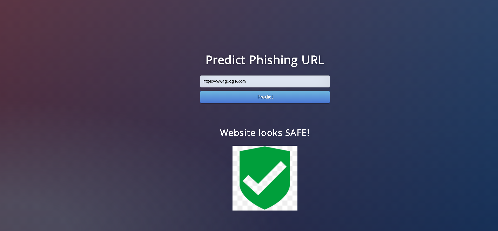
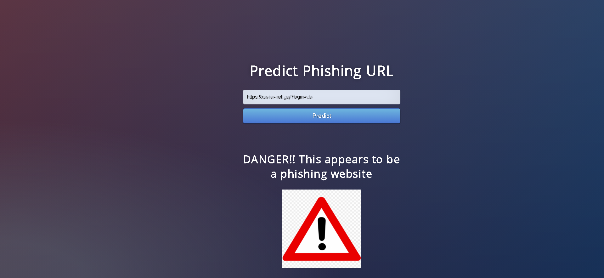

# CyberSpy: Malicious URL Detector
Made a machine learning model as a Part of the Infosys Summer of Ideas Ideathon 2020

Phishing is a type of social engineering attack often used to steal user data, including login credentials and credit card numbers. It occurs when an attacker, masquerading as a trusted entity, dupes a victim into opening an email, instant message, or text message. This leads to the victim giving away private information like OTPs, pins, passwords etc. In modern times, it is extremely important to ensure that users of the world wide web are safeguarded from these attacks. One way to prevent this is by predicting whether or not a particular URL that the user goes to is Malicious or not. 

In this project I have created a Machine Learning Model that predicts whether or not a URL is malicious. To do so, several Machine Learning Algorithms were considered. The different algorithms that were considered were: 

- Categorical Naive Bayes
- K-Nearest Neighbours
- Decision Tree
- Random Forest Classifier
- XGBoost 
- Support Vector Machine

## Dataset Link:
https://archive.ics.uci.edu/ml/datasets/Phishing+Websites#

For a new url, we need to extract the parameters first as per the instructions given along with the dataset.

## Metrics for selecting the algorithm:
On going through the data set, I found that the data was balanced (around 55:45%). Hence, we consider **Accuracy** as our main metric. We will also have to ensure that we will have a minimal **Type one** error (Minimize false positives)(**FPR**). This is because it is important that the user does not enter an unsafe url. We can tradeoff classifying a safe url as unsafe but not the other way around.

## Results
On evaluating these metrics, we found that Random Forests and SVMs gave the highest accuracies and the least false positives. Out of the two, Random Forests showed the best performance with 93.33% Accuracy and 4.08% FPR on the training data and 93.94% Accuracy and 7.96% FPR on the test data

## The Website: 
- Website link: https://maliciousurlchecker.herokuapp.com/
- The website has been created using Flask and deployed on heroku

## Further Scope  
We missed out on a few metrics due to current unavailability of API keys for the phishtank API. This will help our model make a better prediction.
This model is currrently deployed on a website locally. We could deploy this model as a Chrome extention, hence as soon as someone enters a malicious URL, the pop-up could stop tthe user from entering the website.

